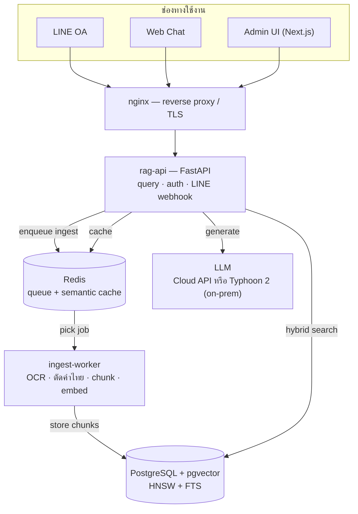
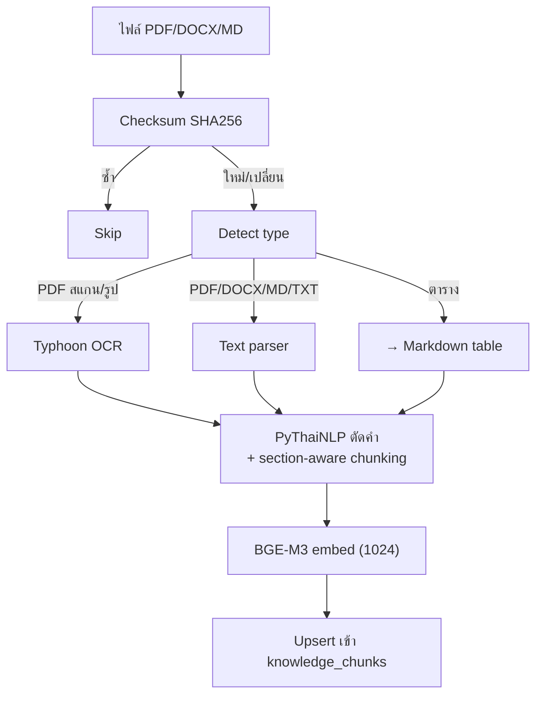
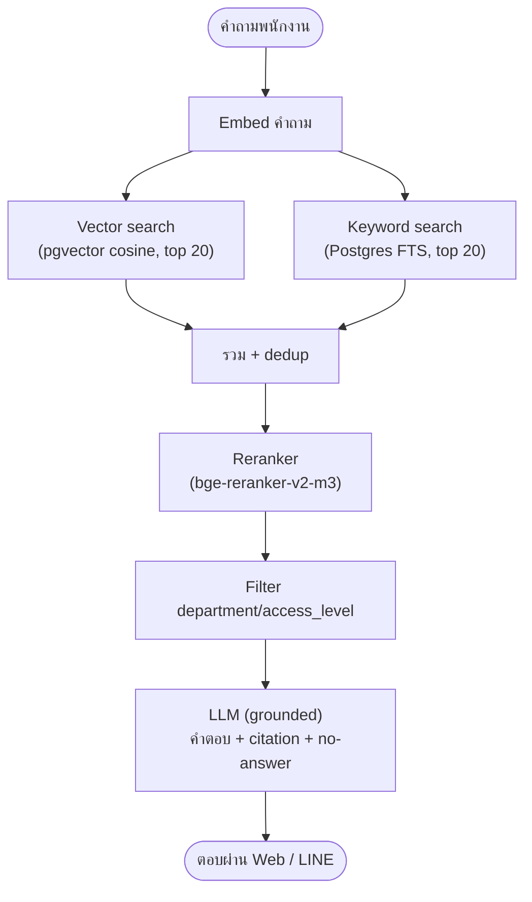

# 🚀 KbaseSME — Start Here (Project Overview)

> **อ่านก่อนหยิบ issue ใดๆ** — issue ย่อยทั้ง 63 ใบรวมกันเป็น *ระบบเดียว*: AI ที่ให้พนักงาน SME ถามเอกสารบริษัทเป็นภาษาไทยผ่าน LINE/เว็บ แล้วได้คำตอบจากเอกสารจริงพร้อมอ้างอิง
> เอกสารเต็ม: `KbaseSME_Product_Design_and_GTM.md` · งานทั้งหมด: `KbaseSME_Project_Task_Breakdown.md`

---

## 1. KbaseSME คืออะไร

### ปัญหาที่แก้

SME ไทย 10–200 คน มีปัญหาซ้ำ:
- พนักงานถามคำถามเดิมซ้ำๆ (ลาได้กี่วัน, เบิกยังไง, SOP คืออะไร)
- ความรู้กระจัดกระจาย — อยู่ใน PDF/Excel/LINE/หัวคนอาวุโส
- turnover สูง → ความรู้หายไปพร้อมคน
- ไม่มีทีม IT ของตัวเอง → ไม่สามารถ setup ระบบ knowledge management เองได้

### Solution — AI Knowledge Assistant

```
พนักงานพิมพ์ "ลากิจได้กี่วัน" ใน LINE OA
  → ระบบค้นจากเอกสาร HR Policy จริงของบริษัท
  → ตอบ: "พนักงานมีสิทธิ์ลากิจได้ 3 วันทำงานต่อปี"
  → อ้างอิง: HR Policy 2026 · หัวข้อ "การลา" · ความมั่นใจ 0.86

ถ้าไม่มีข้อมูล → "ไม่พบข้อมูลเพียงพอ กรุณาติดต่อฝ่าย HR" (ไม่มั่ว)
```

### ทำไมชนะคู่แข่ง

| คู่แข่ง | ราคา | จุดอ่อนที่เราชนะ |
|---|---|---|
| Chatbase (DIY SaaS) | $40–500/mo | Self-serve, อังกฤษ, ไม่จัดข้อมูลให้, ไม่มี LINE OA |
| Zwiz (Thai e-commerce bot) | หลักพัน/เดือน | เก่งปิดการขาย แต่ไม่เจาะ knowledge ลึกจาก SOP/Policy |
| SI / Software House | 5–15 แสน/โปรเจกต์ | แพงเกิน SME, นาน, ไม่มี product สำเร็จรูป |

**ช่องว่างที่เรายึด:** "DFY mid-market" — แพงกว่า DIY แต่ถูกและเร็วกว่า SI หลายเท่า โดยขายงาน "จัดข้อมูล + ติดตั้ง + เชื่อม LINE" ที่ทั้งสองฝั่งไม่ทำ

### โมเดลขาย

- **Done-For-You single-tenant** — เราติดตั้งให้ทีละราย
- **Setup Fee** (ครั้งเดียว) + **ค่าบริการรายเดือน**
- Gross margin > 85% (ต้นทุน LLM ต่ำมาก)
- จุดขาย PDPA: ข้อมูลแยกต่อราย, on-prem ได้, ข้อมูลไม่ออกจากองค์กร

### ICP — ลูกค้าเป้าหมาย 3 vertical แรก

| Vertical | ความเจ็บปวด | เอกสารที่ ingest |
|---|---|---|
| คลินิก/ความงาม | พนักงานถามขั้นตอน/ราคา/โปรซ้ำ, turnover สูง | SOP, ราคา, การเคลม |
| สำนักงานบัญชี/กฎหมาย | คำถาม compliance ซ้ำ, ความรู้อยู่กับ senior | ระเบียบภาษี, checklist, template |
| ค้าปลีก/แฟรนไชส์ | สาขาเยอะ, มาตรฐานไม่ตรงกัน | SOP สาขา, นโยบายคืนสินค้า, โปรโมชัน |

---

## 2. Architecture — 6 Containers



| Container | หน้าที่ | Tech |
|---|---|---|
| `nginx` | reverse proxy, TLS, basic protection | Nginx |
| `rag-api` | REST API, auth, query orchestration, LINE webhook | FastAPI (Python 3.12) |
| `ingest-worker` | parse → OCR → ตัดคำ → chunk → embed → upsert | Python + Celery/Arq |
| `redis` | job queue + **semantic cache** | Redis |
| `postgres` | catalog + chunks + vectors + logs | PostgreSQL 16 + pgvector |
| `web` | Chat UI + Admin UI | Next.js |

> **Modular monolith** — `rag-api` เป็น service เดียว แยกแค่ `ingest-worker` เป็น async (ไฟล์ใหญ่/OCR ช้า ห้าม block) — ไม่แยก microservices ตั้งแต่แรกเพราะต้นทุน DevOps ที่ SME ไม่จ่ายให้

**Deploy ได้ 2 แบบจาก codebase เดียว:**
- **Hosted single-tenant** — VPS เล็ก 1 เครื่องต่อลูกค้า + Cloud LLM API
- **On-Premise** — server ลูกค้า + Local LLM (Typhoon 2 ผ่าน Ollama/vLLM) → ข้อมูลไม่ออกนอกออฟฟิศ

---

## 3. Data Flow — ไฟล์ → คำตอบ

### Ingestion Pipeline (เขียนใหม่จาก POC)



**3 จุดที่แก้จาก POC:**
1. **ตัดคำไทย** — เลิก `text.split()` → ใช้ PyThaiNLP + chunk ตาม section/ประโยค
2. **PDF สแกน** — เพิ่ม Typhoon OCR (open VLM ไทย, BLEU ~0.91)
3. **ตาราง** — แปลงเป็น Markdown table ก่อน chunk (ตารางเบิกจ่ายไม่เพี้ยน)

### Retrieval Pipeline (Hybrid + Rerank)



**แก้ปัญหา vector-only:** คำเฉพาะ/ตัวย่อ/วลีไทยสั้นที่ vector มองข้าม → keyword จับ → reranker คัดคุณภาพอีกชั้น

### Generation — Grounded + No-Answer

- Prompt บังคับ: ตอบจาก context เท่านั้น · ไทยเมื่อถามไทย · อ้าง source
- **ถ้า rerank score < threshold → "ไม่พบข้อมูลเพียงพอ"** (กัน hallucination)
- Semantic cache (Redis): คำถามซ้ำ cache hit < 200ms → ไม่เสีย token

---

## 4. Data Model

ทุกตารางมี `tenant_id` ตั้งแต่วันแรก (single-tenant: default=1, SaaS: จาก JWT)

```sql
-- tenants → ข้อมูลลูกค้าแต่ละราย
-- app_users → ผู้ใช้ (email, line_user_id, role, departments[])
-- knowledge_sources → 1 แถว = 1 ไฟล์ต้นทาง (checksum, version, status, access_level)
-- knowledge_chunks → N แถว = chunks ของไฟล์ (content, content_tsv, embedding vector(1024))
-- document_ingestion_jobs → สถานะ ingestion (queued|running|done|error, step)
-- rag_query_logs → คำถาม-คำตอบ-แหล่งอ้างอิง-feedback-latency-token
```

**Indices สำคัญ:**
- `HNSW (embedding vector_cosine_ops)` — ANN เร็ว
- `GIN (content_tsv)` — keyword/FTS search
- Composite: `(tenant_id, department, access_level)` — filter ตามสิทธิ์
- `(tenant_id, checksum)` — dedup ไฟล์ซ้ำ

---

## 5. API Contract

REST, JSON, JWT auth · `/api/v1`

| Method · Endpoint | หน้าที่ | Auth |
|---|---|---|
| `POST /auth/login` | login → JWT (tenant_id, role, departments) | public |
| `POST /query` | ถาม → คำตอบ + sources + latency | user |
| `POST /documents` | upload ไฟล์ → job_id | admin |
| `GET /documents` | list sources + status + chunk count | admin |
| `POST /documents/{id}/reindex` | re-index ไฟล์เดียว | admin |
| `DELETE /documents/{id}` | archive + ลบ chunks | admin |
| `GET /jobs/{id}` | สถานะ ingestion job | admin |
| `GET /logs` | query logs + คำถามตอบไม่ได้ + feedback | admin |
| `POST /feedback` | correct/wrong/unclear | user |
| `POST /line/webhook` | รับ event จาก LINE | LINE signature |
| `GET /health` | health check | public |

**Response ตัวอย่าง `POST /query`:**
```json
{
  "answered": true,
  "answer": "พนักงานมีสิทธิ์ลากิจได้ 3 วันทำงานต่อปี",
  "sources": [
    { "title": "HR Policy 2026", "section": "การลา",
      "source_id": "...", "rerank_score": 0.86 }
  ],
  "latency_ms": 740,
  "from_cache": false
}
```

---

## 6. Tech Stack

| ชั้น | ใช้ | เหตุผล |
|---|---|---|
| Backend | Python 3.12, FastAPI, Celery/Arq | ตรงสกิล Dear, ecosystem ดี |
| Vector DB | PostgreSQL 16 + pgvector (HNSW + FTS) | ไม่ต้องแยก vector DB, deploy ง่าย |
| Embedding | BGE-M3 (1024-dim, self-host) | ไทยแม่นกว่า MiniLM, hybrid, ฟรี |
| Reranker | bge-reranker-v2-m3 | cross-encoder ไทยได้ |
| Thai NLP | PyThaiNLP (tokenize), Typhoon OCR (สแกน) | ตัดคำไทยถูก, OCR สแกนออก |
| LLM (Cloud) | Gemini 3.1 Flash-Lite / GPT-4.1-nano | ถูกสุด ($0.10/$0.40 per 1M), margin > 85% |
| LLM (On-Prem) | Typhoon 2 (Ollama/vLLM) | ฟรี, ข้อมูลไม่ออกนอก |
| Cache/Queue | Redis | semantic cache + job queue |
| Frontend | Next.js | Chat + Admin, static export ได้ |
| Deploy | Docker Compose, nginx, TLS | hosted VPS หรือ on-prem |

---

## 7. Security & PDPA

- **Single-tenant / On-Prem** = ข้อมูลลูกค้าแยก 100% — จุดขาย PDPA
- **Backend ใช้ service role เท่านั้น** — ไม่ expose key ออก frontend
- **Department-level access control** — เอกสาร restricted ไม่หลุดข้าม role
- **DPA (Data Processing Agreement)** — เซ็นกับลูกค้าทุกราย (เราเป็น Data Processor)
- **Audit log** — ใครถามอะไร เห็นเอกสารไหน
- **เข้ารหัส** at-rest + in-transit (TLS + pgcrypto)
- **Delete routine** — ลบข้อมูลทั้งหมดเมื่อเลิกสัญญา

---

## 8. Pricing

| | **Starter** | **Growth** ⭐ | **Business** |
|---|---|---|---|
| รายเดือน | 4,900 ฿ | 14,900 ฿ | 39,900 ฿ |
| Setup Fee | 50,000 ฿ | 80,000–120,000 ฿ | 150,000–200,000 ฿ |
| Users / Docs | 10 / 200 | 50 / 2,000 | 200 / ไม่จำกัด |
| Deployment | Hosted | Hosted | **On-Prem** |
| LINE OA | — | ✓ | ✓ |
| LLM | Cloud (Flash-Lite) | Cloud | **Local Typhoon 2** |

**Unit Economics (Growth):** COGS ~800–1,300 ฿/เดือน → **margin ~91%** · มูลค่าต่อดีลปีแรก ~279,000 ฿

---

## 9. Milestones

| # | Milestone | เงื่อนไขผ่าน | Phase |
|---|---|---|---|
| M1 | **RAG core ใหม่พร้อม** | ingestion+retrieval ใหม่ ผ่าน eval ≥ 90% | P1 build |
| M2 | **MVP ครบช่องทาง** | web + admin + LINE end-to-end | P1 build |
| M3 | **ขายได้** | demo env + pricing + DPA + sales material | P1+GTM |
| M4 | **ลูกค้าจ่ายเงินรายแรก go-live** | DFY playbook ครบ + UAT sign-off | Pilot |
| M5 | **Delivery ทำซ้ำได้** | ดีลที่ 2–3 ใช้เวลาน้อยลง, template ครบ | Productize |
| M6 | **ดูแลหลายลูกค้าได้** | monitoring/backup/update pipeline 5–10 ราย | Scale |

---

## 10. Critical Path — เริ่มตรงไหน

```mermaid
flowchart LR
  E11["E1-1 schema"] --> E2["E2-1/E2-2<br/>ingestion + ตัดคำไทย"]
  E2 --> E31["E3-1 BGE-M3"] --> E32["E3-2 hybrid"] --> E33["E3-3 rerank"] --> E34["E3-4 grounded + no-answer"]
  E34 --> M1{{"M1 · RAG core"}}
  M1 --> E4["E4-2/4-3 API"] --> E5["E5-1/5-2 Web+Admin"] --> E6["E6 LINE OA"]
  E6 --> M2{{"M2 · MVP ครบช่องทาง"}}
  M2 --> E9["E9-1 docker + E9-4 demo"] --> GTM["GTM-1/2/3/5<br/>pricing · DPA · sales · pilot offer"]
  GTM --> M3{{"M3 · ขายได้"}}
  M3 --> PIL["PIL-1..5<br/>data prep → tuning → go-live"]
  PIL --> M4{{"M4 · ลูกค้าจ่ายเงินรายแรก"}}
```



**เริ่มพรุ่งนี้ (ทำขนานได้ ไม่ block กัน):**
1. `E1-1` — Production schema
2. `E2-2` — ตัดคำไทย PyThaiNLP
3. `E8-2` — Mock golden set

---

## 11. 6-Week Build Plan

| สัปดาห์ | ส่งมอบ |
|---|---|
| **W1** | Production schema + migrate POC + ingestion ใหม่ (checksum, PyThaiNLP, source/chunk) |
| **W2** | BGE-M3 + hybrid retrieval + reranker + no-answer + golden set + eval |
| **W3** | FastAPI API ครบ + auth + async ingest (Redis queue) |
| **W4** | Web Chat UI + Admin UI |
| **W5** | LINE OA + semantic cache + Typhoon OCR + security hardening |
| **W6** | E2E test + eval ≥90% + deploy + demo env + runbook |

> ทำคนเดียว part-time → ยืด 7–8 สัปดาห์ได้ · ห้ามลดคุณภาพ E3 (core ที่ทำให้ "ขายได้")

---

## 12. Success Metrics

**Product / คุณภาพ:**
- Answer pass rate บน golden set ≥ **90%**
- Citation correctness ≥ **95%** · No-answer correctness ≥ **95%**
- Latency p50 < 1.5s (cache hit < 200ms) · Cache hit rate ≥ **30%**
- Cost/query ต่ำ (ติดตามจาก token logs)

**Business:**
- Paid pilot → pilot-to-paid conversion ≥ **50%**
- Gross margin ≥ **85%**
- Time-to-go-live ≤ **4 สัปดาห์** ต่อลูกค้า
- Logo churn < 10%/ปี

---

## 13. Risks & Mitigations

| ความเสี่ยง | ผลกระทบ | การรับมือ |
|---|---|---|
| **Garbage In, Garbage Out** — เอกสารขัดแย้ง/ล้าสมัย | ตอบผิด → เสียความเชื่อมั่น | Document Audit + versioning + รายงานคำถามตอบไม่ได้ |
| **Hallucination** | ตอบมั่ว = ความเสี่ยงพาณิชย์อันดับ 1 | grounded prompt + rerank threshold + no-answer + citation + eval |
| **Thai data prep ยาก** | ingest พลาด, chunk เพี้ยน | Typhoon OCR + PyThaiNLP + table→markdown |
| **Vector ขยะปนกัน** | ตอบด้วยข้อมูลเก่า | source catalog + checksum + ลบ chunk เก่าอัตโนมัติ |
| **PDPA / ข้อมูลรั่ว** | โทษปรับ + เสียชื่อ | single-tenant/on-prem + DPA + audit log + service-role only |
| **Adoption ต่ำ** | ลูกค้าไม่ต่อสัญญา | LINE OA + rich menu + อบรม + รายงาน usage รายเดือน |
| **พึ่ง Dear คนเดียว** | scale ไม่ได้ | productize delivery playbook → จ้าง DATA+DEL |

---

## 14. Epics — ดูแต่ละกลุ่ม

| Epic | ขอบเขต | Tasks | Issues |
|---|---|---|---|
| **E1 Data & Schema** | schema, migration, tenant_id | E1-1..3 | #1–#3 |
| **E2 Ingestion** | dedup, OCR, ตัดคำไทย, table | E2-1..5 | #4–#8 |
| **E3 Retrieval/RAG** | BGE-M3, hybrid, rerank, no-answer | E3-1..6 | #9–#14 |
| **E4 API** | auth, query, documents, logs | E4-1..5 | #15–#19 |
| **E5 Frontend** | Web Chat + Admin UI | E5-1..4 | #20–#23 |
| **E6 LINE OA** | webhook, user map, reply, rich menu | E6-1..4 | #24–#27 |
| **E7 Security/PDPA** | service-role, TLS, audit, RLS | E7-1..4 | #28–#31 |
| **E8 Eval/QA** | eval harness, golden set | E8-1..3 | #32–#34 |
| **E9 DevOps** | docker, on-prem, backup, demo | E9-1..4 | #35–#38 |
| **Phase 2 Delivery** | DFY playbook, templates, reports | PD-1..5 | #39–#43 |
| **Phase 3 GTM** | pricing, DPA, sales, leads | GTM-1..6 | #44–#49 |
| **Phase 4 Pilot** | ลูกค้าจริงรายแรก | PIL-1..6 | #50–#55 |
| **Phase 5 Scale** | monitoring, multi-customer ops | SC-1..4 | #56–#59 |
| **Phase 6 SaaS** | RLS, signup, billing (อนาคต) | SAAS-1..4 | #60–#63 |

---

## 15. วิธีอ่านบอร์ด

- **Priority:** `prio:P0` (ต้องมีถึงขายดีลแรก) → `prio:P1` (ขายซ้ำ/scale) → `prio:P2` (อนาคต) — **ทำ P0 ให้หมดก่อน**
- **Role:** `role:ARC/BE/FE/DATA/DEVOPS/QA/DEL/BIZ` — ตอนนี้ Dear ครอบ ARC+BE+DEVOPS+BIZ; จ้าง DATA+DEL ก่อนเมื่อมีดีล
- **Phase:** `phase:build/productize/gtm/pilot/scale/saas`
- แต่ละ issue มี **Depends (linked) / Acceptance Criteria / Estimate / Definition of Done** ใน body

### Solo-Founder Mapping

| ตอนนี้ Dear ทำ | จ้างเพิ่มเมื่อมีดีล |
|---|---|
| ARC + BE + DEVOPS + BIZ | DATA (data prep/OCR) + DEL (delivery/onboarding) ก่อน |
| | → FE/QA part-time → แยก BIZ เมื่อ pipeline โต |

**เป้าหมาย:** productize งาน DATA/DEL ให้ delegate ได้ → Dear โฟกัส ARC + BIZ

---

## 16. เอกสารอ้างอิง

| เอกสาร | เนื้อหา |
|---|---|
| [`KbaseSME_Product_Design_and_GTM.md`](KbaseSME_Product_Design_and_GTM.md) | Product design เต็ม: architecture, data model, API contract, RAG pipeline, pricing, GTM, DFY playbook, risks |
| [`KbaseSME_Project_Task_Breakdown.md`](KbaseSME_Project_Task_Breakdown.md) | WBS 63 tasks: roles, dependencies, estimates, DoD, critical path, 6-week plan |
| [`START_HERE_overview.md`](START_HERE_overview.md) | **เอกสารนี้** — ภาพรวมระบบ อ่านก่อนเริ่ม |
