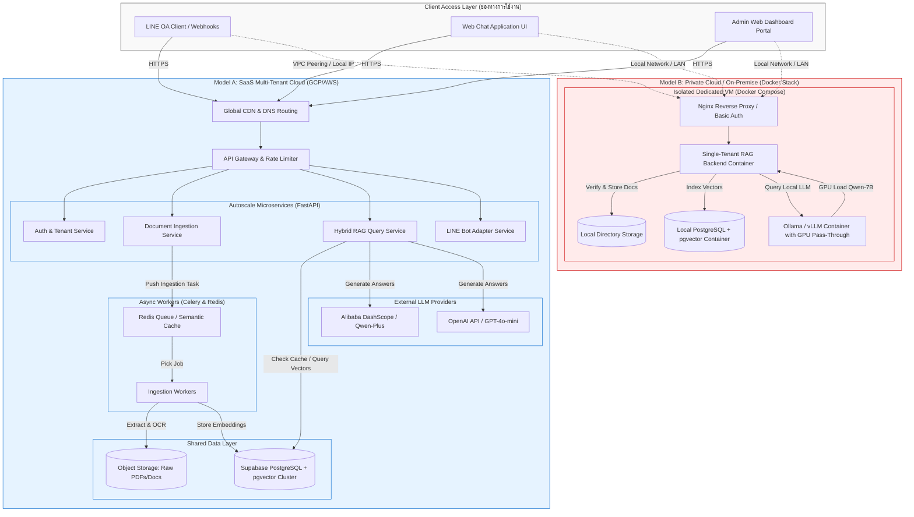
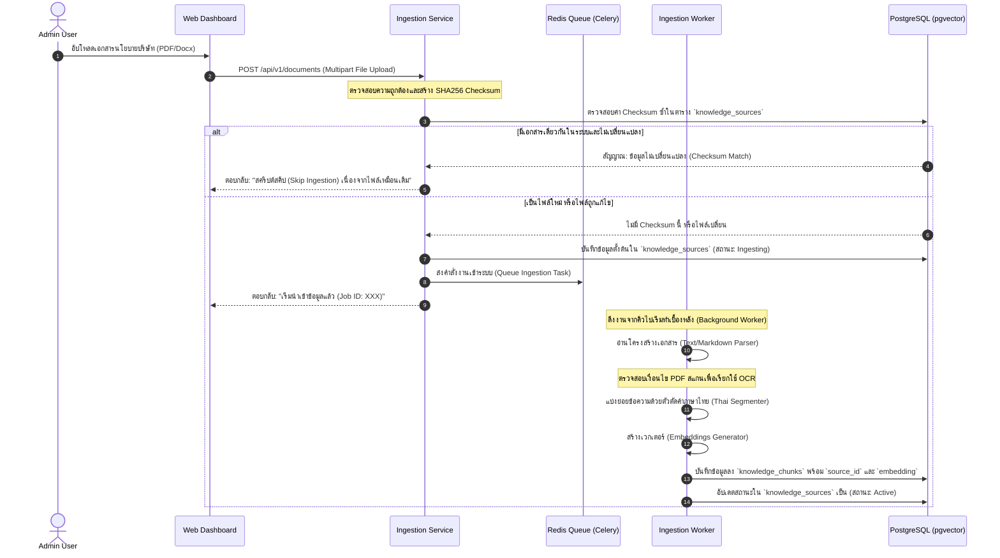
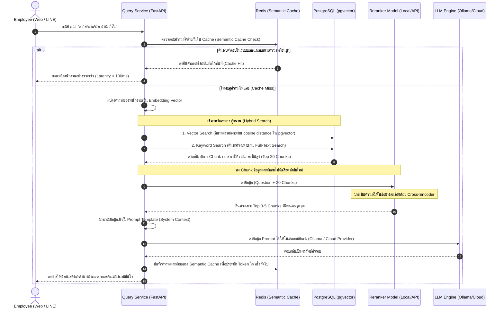

# Production-Grade Hybrid RAG Platform Architecture
> **SME Internal Knowledge Base AI Assistant**
> เอกสารสถาปัตยกรรมระบบขั้นสูง ออกแบบมาเพื่อรองรับการเติบโตแบบ Mass-Market ทั้งรูปแบบคลาวด์สาธารณะ (Multi-tenant SaaS) และการติดตั้งในคลาวด์ส่วนตัว/เซิร์ฟเวอร์สำนักงาน (Single-tenant Private Cloud / On-Premise)

---

## 1. ภาพรวมสถาปัตยกรรมระดับระบบ (System Architecture Overview)

แพลตฟอร์มนี้ใช้วิธี **"Core API + Adaptable Plugs"** เพื่อให้ซอฟต์แวร์ชุดเดียวกัน (Single Codebase) สามารถแยกตัวไปรันในสภาพแวดล้อมต่าง ๆ ได้อย่างไร้รอยต่อ



---

## 2. ขั้นตอนการนำเข้าข้อมูล (Ingestion Pipeline Sequence Diagram)

เมื่อผู้ใช้ทำการอัปโหลดเอกสาร (เช่น คู่มือพนักงาน .pdf หรือ SOP .docx) การประมวลผลจะเป็นแบบอซิงโครนัส (Asynchronous) เพื่อป้องกันปัญหาหน้าจอค้างในกรณีที่ไฟล์มีขนาดใหญ่



---

## 3. ขั้นตอนการถามตอบและการจัดอันดับใหม่ (RAG Query & Reranking Sequence)

เมื่อพนักงานส่งคำถามเข้ามาทางหน้าเว็บแชท หรือทาง LINE OA ระบบจะทำการวิเคราะห์ค้นหาอย่างละเอียดโดยใช้สถาปัตยกรรมแบบ **Hybrid Search** และ **Reranker** เพื่อยืนยันว่าข้อมูลตอบกลับจะแม่นยำที่สุด



---

## 4. โครงสร้างความปลอดภัยและการแบ่งแยกข้อมูลลูกค้า (Multi-Tenant Security Isolation)

สำหรับระบบ SaaS ส่วนกลางที่ต้องจัดเก็บข้อมูลของลูกค้าหลายบริษัทรวมกัน จะต้องใช้ **Row Level Security (RLS)** ของ PostgreSQL ในระดับซอฟต์แวร์และฮาร์ดแวร์เพื่อไม่ให้ข้อมูลเกิดการรั่วไหลข้ามองค์กร

```sql
-- เปิดการใช้งาน RLS บนตารางข้อมูล
alter table knowledge_sources enable row level security;
alter table knowledge_chunks enable row level security;

-- นโยบาย RLS บังคับว่าผู้ใช้จะเห็นเฉพาะข้อมูลของ tenant_id ตัวเองที่ได้รับสิทธิ์เท่านั้น
create policy tenant_isolation_sources_policy on knowledge_sources
    for all
    using (tenant_id = current_setting('app.current_tenant_id', true)::uuid);

create policy tenant_isolation_chunks_policy on knowledge_chunks
    for all
    using (tenant_id = current_setting('app.current_tenant_id', true)::uuid);
```

> [!IMPORTANT]
> **ระบบสิทธิ์ใน Backend Application:**
> ทุกครั้งที่มีการติดต่อเข้าฐานข้อมูลในรูปแบบ Multi-Tenant ระบบ FastAPI Router จะทำการดึง `tenant_id` ออกจาก JSON Web Token (JWT) ของผู้นั้น และนำไปทำธุรกรรมใน SQL โดยใช้ `SET LOCAL app.current_tenant_id = '...'` ก่อนรันคำสั่ง Query เสมอ เพื่อการันตีความปลอดภัยสูงสุด

---

## 5. การวิเคราะห์เปรียบเทียบสถาปัตยกรรมสำหรับฝั่งขาย Mass

| ประเด็นการวิเคราะห์ | รูปแบบคลาวด์ร่วม (SaaS Multi-Tenant) | รูปแบบส่วนตัว (Private Cloud / On-Premise) |
| :--- | :--- | :--- |
| **กลุ่มลูกค้าเป้าหมาย** | แผนเริ่มต้น (Starter) และ แผนเติบโต (Growth) | แผนองค์กรระดับธุรกิจ (Business / Enterprise) |
| **การจัดการข้อมูล** | ข้อมูลถูกเก็บในคลาวด์ศูนย์กลาง แยกตามสิทธิ์ RLS | ข้อมูลถูกเก็บอยู่ในเน็ตเวิร์กภายในบริษัท 100% |
| **ค่าบำรุงรักษารายเดือน** | ต่ำ (เนื่องจากแชร์โครงสร้างพื้นฐานเซิร์ฟเวอร์ร่วมกัน) | ปานกลางถึงสูง (ตามรอบการเช่า GPU หรือค่าดูแล SLA) |
| **โมเดล LLM หลัก** | Cloud API (จ่ายเงินตามการโทรใช้งานจริง) | Local LLM (ผ่าน Ollama / vLLM บน GPU การ์ดจอส่วนตัว) |
| **ความสะดวกในการอัปเดต** | อัปเดตพร้อมกันได้ในปุ่มเดียวจากส่วนกลาง | ต้องส่งชุดคำสั่ง Docker Compose ไปอัปเกรดแบบรายจุด |
| **ความซับซ้อนการติดตั้ง** | ไม่มี (คลิกสมัครใช้งานผ่านเว็บได้ทันที) | ปานกลาง (ต้องการการตั้งค่าเครื่องคอมพิวเตอร์และไดรเวอร์การ์ดจอ) |
